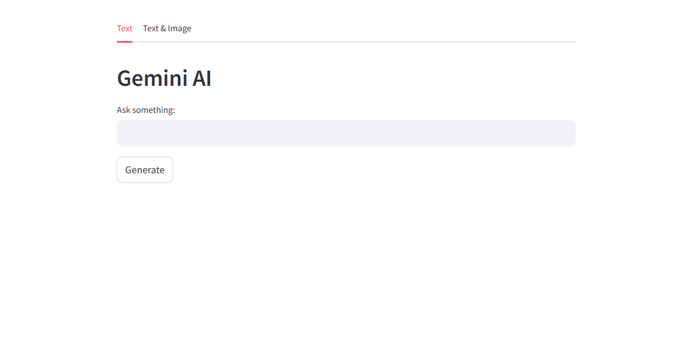

# End-to-End Gemini-LLM Deployment

### Google Gemini Streamlit Application

#### Project Overview

This project is a web application built using Streamlit that leverages Google Gemini’s generative AI model to create a Q&A interface. 
The app allows users to input text or both text and images to receive intelligent responses from the Gemini model in real-time.

#### Key Features:
- **Text Input Tab**: Users can submit text queries and receive AI-generated responses.
- **Text & Image Input Tab**: Users can upload images along with text to generate multimodal responses.
- **Gemini Model Integration**: The app uses Google's `Gemini-1.5-flash` model for robust natural language and image-based interaction.

#### How It Works:
- **Google Gemini API**: The app is connected to Google Gemini’s API using a valid API key for content generation.
- **Streamlit**: The web interface is built using Streamlit, offering an easy-to-use experience with separate tabs for different input types.

#### Requirements

- Python 3.8+
- Streamlit
- Google Gemini API Key
- Python dependencies listed in `requirements.txt`

#### App Snapshot

